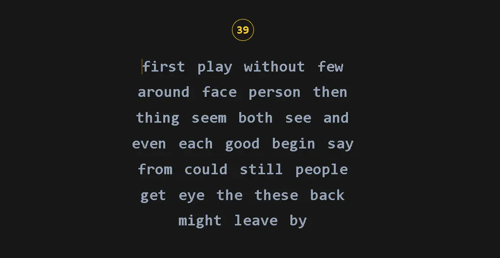

<div align="center">
    
    <h2> Breaking Keyboard </h2>
    <p> This webpage is for practice and improve my skills in DOM managment</p>
</div>



## 🛠️ Stack
- Vanilla


## 🚀 Getting Started

1. [Fork](https://github.com/BryanAMG/youtube-clone/fork) or clone this repository.

```bash
git clone git@github.com:midudev/esland-web.git
```
2. Install the dependencies:

- We use [pnpm](https://pnpm.io):

```bash
# Install pnpm globally if you don't have it:
npm install -g pnpm

# Install dependencies:
pnpm install
```

3. Run the development server:

```bash
# Run with pnpm:
pnpm dev
```

## 🧞 Commands

|     | Command          | Action                                        |
| :-- | :--------------- | :-------------------------------------------- |
| ⚙️  | `dev` or `start` | Starts local dev server at `localhost:3000`.  |
| ⚙️  | `build`          | Build your production site to `./dist/`.      |
| ⚙️  | `preview`        | Preview your build locally, before deploying. |
